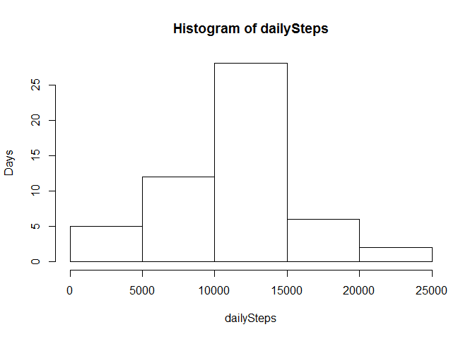

# Reproducible Research: Peer Assessment 1


## Loading and preprocessing the data
Simple is beautiful. Just load the data as `dataset`

```r
dataset <- read.csv("activity.csv")
```
Prepare a function which converts interval number,
which is consist of hour and minute digits to actual time.

(Note: You may not use interval number as interger
since the interval between interval number 1059 and 1100,
which represent 10:59 and 11:00, is recognized as 41.)

```r
interval2time <- function(x) {
    strptime(sprintf("%02d:%02d", x%/%100, x%%100), format = "%H:%M")
}
```

## What is mean total number of steps taken per day?
Sum the steps for each day and store the variable `dailySteps`.

```r
dailySteps <- tapply(dataset$steps, dataset$date, sum)
hist(dailySteps, ylab = "Days")
```

 

The mean and median of daily steps are as follows.

```r
mean(dailySteps, na.rm = TRUE)
```

```
## [1] 10766.19
```

```r
median(dailySteps, na.rm = TRUE)
```

```
## [1] 10765
```

## What is the average daily activity pattern?


```r
stepsPerInterval <- aggregate(steps ~ interval, data=dataset, mean)
stepsPerInterval$timeOfDay <- interval2time(stepsPerInterval$interval)
with(stepsPerInterval, plot(timeOfDay, steps,type = "l"))
```

 

```r
stepsPerInterval[which.max(stepsPerInterval$steps),]
```

```
##     interval    steps           timeOfDay
## 104      835 206.1698 2015-04-20 08:35:00
```

## Imputing missing values
At first, Let's investigate the total number of missing values.

```r
table(factor(is.na(dataset$steps)))
```

```
## 
## FALSE  TRUE 
## 15264  2304
```
There are 2304 missing values out of 17568 observations.

Before devising a strategy to fill out missing values,
Let's Look at the distribution of missing value(NA)s.
The daily distribution of NA's are as follows.

```r
with(dataset, tapply(is.na(steps), date, sum))
```

```
## 2012-10-01 2012-10-02 2012-10-03 2012-10-04 2012-10-05 2012-10-06 
##        288          0          0          0          0          0 
## 2012-10-07 2012-10-08 2012-10-09 2012-10-10 2012-10-11 2012-10-12 
##          0        288          0          0          0          0 
## 2012-10-13 2012-10-14 2012-10-15 2012-10-16 2012-10-17 2012-10-18 
##          0          0          0          0          0          0 
## 2012-10-19 2012-10-20 2012-10-21 2012-10-22 2012-10-23 2012-10-24 
##          0          0          0          0          0          0 
## 2012-10-25 2012-10-26 2012-10-27 2012-10-28 2012-10-29 2012-10-30 
##          0          0          0          0          0          0 
## 2012-10-31 2012-11-01 2012-11-02 2012-11-03 2012-11-04 2012-11-05 
##          0        288          0          0        288          0 
## 2012-11-06 2012-11-07 2012-11-08 2012-11-09 2012-11-10 2012-11-11 
##          0          0          0        288        288          0 
## 2012-11-12 2012-11-13 2012-11-14 2012-11-15 2012-11-16 2012-11-17 
##          0          0        288          0          0          0 
## 2012-11-18 2012-11-19 2012-11-20 2012-11-21 2012-11-22 2012-11-23 
##          0          0          0          0          0          0 
## 2012-11-24 2012-11-25 2012-11-26 2012-11-27 2012-11-28 2012-11-29 
##          0          0          0          0          0          0 
## 2012-11-30 
##        288
```

As you can see, some days have no data.
Since 288 NA's means all the 24 * 60 / 5 = 288 data are NA's,
we cannot fill the NA as daily mean or median.

Instead, we can fill the NA's with daily mean of each interval.
Let's reuse the `stepsPerInterval` variable.

```r
names(stepsPerInterval)[2] <- "default"
combo <- merge(dataset, stepsPerInterval)
combo$steps[is.na(combo$steps)] <- combo$default[is.na(combo$steps)]
combo$default <- NULL
```

After fill out the missing values,
let's re-calculate the distribution of daily steps.

```r
dailyStepsFilled <- tapply(combo$steps, combo$date, sum)
hist(dailyStepsFilled, ylab = "Days")
```

 

```r
mean(dailyStepsFilled, na.rm = TRUE)
```

```
## [1] 10766.19
```

```r
median(dailyStepsFilled, na.rm = TRUE)
```

```
## [1] 10766.19
```

## Are there differences in activity patterns between weekdays and weekends?
First, label the dates with weekday or weekend.

```r
date2daytype <- function(x) {
    wd <- as.POSIXlt(x)$wday
    if (wd == 0 | wd == 6) {
        "weekend"
    } else {
        "weekday"
    }
}
dataset$daytype <- sapply(dataset$date, date2daytype)
```

Take the average for each time interval by weekdays or weekends.

```r
stepsTrend <- aggregate(steps ~ daytype + interval,
                        data = dataset, mean, na.rm=TRUE)
stepsTrend$timeOfDay <- interval2time(stepsTrend$interval)
```

Draw the graph of the steps trend.

```r
library(ggplot2)
qplot(timeOfDay, steps, data=stepsTrend, facets=daytype ~ ., geom='path')
```

 

As you can see, there are some differences between weekdays and weekends.
